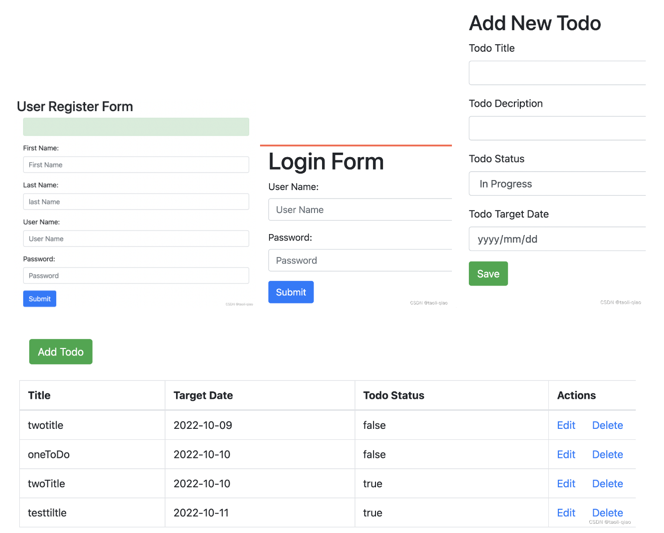

### Running the demo step
1. Install mysql 
2. Create DB name "servlet"
3. Initial DB with script.sql
4. Update JDBCUtils in com.example.servletdemo package with your db username and password
5. Configure Tomcat in Run Configuration
6. Run the demo

Demo主要包含注册、登陆、增删改查ToDoList三大模块功能

